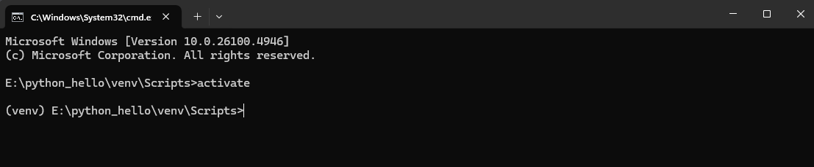

# HelloWorldAPI

A simple **Python REST API** built using **Flask** that returns a "Hello, World!" message.

## Features

- Built with Python 3 and Flask
- REST API endpoint `/hello` that returns JSON
- Lightweight and easy to extend
- Suitable for learning basic API development in Python

## Requirements

- Python 3.x
- Flask

## Installation

1. Clone the repository:

```bash
git clone https://github.com/ganeshpathak/python_hello.git
cd python_hello
```

2. Create and activate a virtual environment:

```bash
python -m venv venv
venv\Scripts\activate   # On Windows
# OR
source venv/bin/activate # On Linux/Mac
```

### Screenshot: Virtual Environment Activation



*(Replace `venv_activation.png` with your actual screenshot file in the project root)*

3. Install dependencies:

```bash
pip install -r requirements.txt
```

## Running the API

Start the server:

```bash
python app.py
```

By default, the API runs on `http://127.0.0.1:5000`.

## API Endpoint

- **GET /hello**  
  Returns a JSON message:

```json
{
  "message": "Hello, World!"
}
```

### Example Screenshot


*(Replace `screenshot.png` with your actual screenshot file in the project root)*

## Project Structure

```
HelloWorldAPI/
├── app.py                  # Main application file
├── requirements.txt        # Python dependencies
├── .gitignore              # Ignored files (venv, cache, etc.)
├── README.md               # Project documentation
├── venv_activation.png     # Screenshot for virtual environment activation
└── screenshot.png          # Screenshot of API response
```

## License

This project is licensed under the MIT License.

